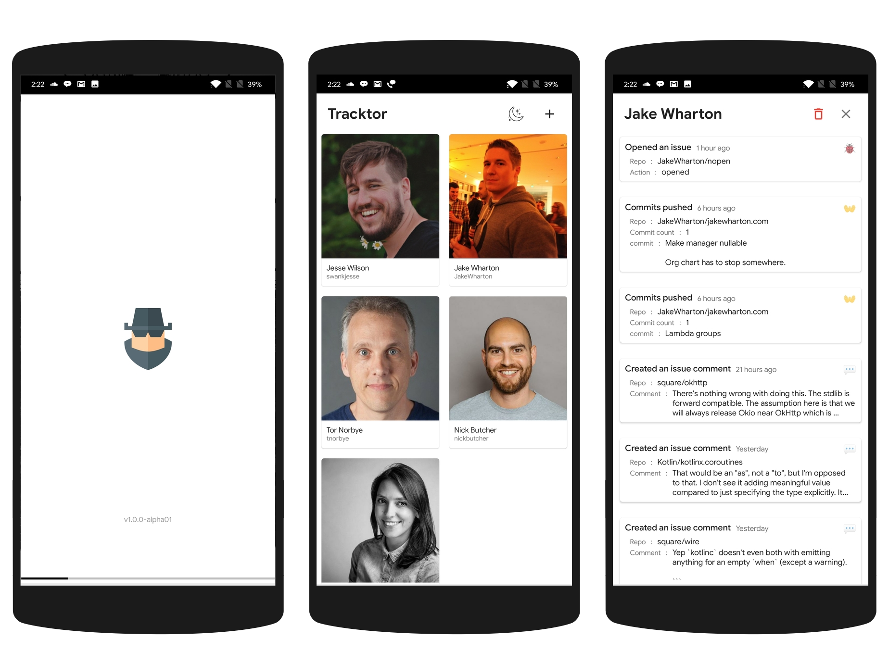
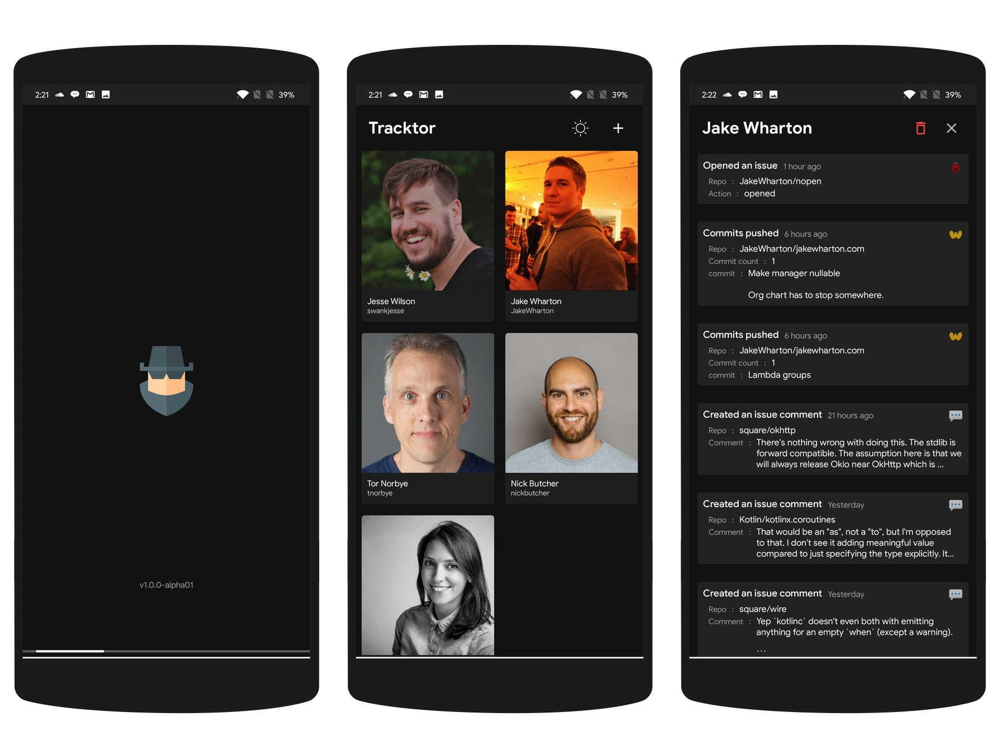

# tracktor 🕵️

[](https://github.com/theapache64/tracktor/issues)
[](https://github.com/theapache64/tracktor/network)
[](https://github.com/theapache64/tracktor/stargazers)
[](https://github.com/theapache64/tracktor/blob/master/LICENSE)
[](https://twitter.com/intent/tweet?text=Wow,%20Checkout%20this%20repo%20https%3A%2F%2Fgithub.com%2Ftheapache64%2Ftracktor)

A GitHub user tracking app, inspired from below GIF 🤷

*Can be considered as a demo project to showcase MVVM with latest android development tools*

<p align="center">

</p>

## Dark Mode Available 🌙



## Usage 📱

There's this person. You admire him a lot because he's a very passionate programmer. You press the  **follow** button but you're not satisfied with
GitHub's feed, since it shows only minimal information about the person you follow. Then this app is for you 😉


## How to use? 🤔

- Install the latest APK from [releases](https://github.com/theapache64/tracktor/releases) 📥
- Add him/her to the list by entering the GitHub `username`
- Done 👍

*Now you can see whatever he does 😜* 

## Built With 🛠

### Core 😍

- [Kotlin](https://kotlinlang.org/) - First class and official programming language for Android development.
- [Coroutines](https://kotlinlang.org/docs/reference/coroutines-overview.html) - For asynchronous and more..
- [Flow](https://kotlin.github.io/kotlinx.coroutines/kotlinx-coroutines-core/kotlinx.coroutines.flow/-flow/) - A cold asynchronous data stream that sequentially emits values and completes normally or with an exception.
- [Android Architecture Components](https://developer.android.com/topic/libraries/architecture) - Collection of libraries that help you design robust, testable, and maintainable apps.
  - [LiveData](https://developer.android.com/topic/libraries/architecture/livedata) - Data objects that notify views when the underlying database changes.
  - [ViewModel](https://developer.android.com/topic/libraries/architecture/viewmodel) - Stores UI-related data that isn't destroyed on UI changes. 
  - [ViewBinding](https://developer.android.com/topic/libraries/view-binding) - Generates a binding class for each XML layout file present in that module and allows you to more easily write code that interacts with views.
  - [Room](https://developer.android.com/topic/libraries/architecture/room) - SQLite object mapping library.
- [Dagger 2](https://dagger.dev/) - Dependency Injection Framework
- [Retrofit](https://square.github.io/retrofit/) - A type-safe HTTP client for Android and Java.
- [Moshi](https://github.com/square/moshi) - A modern JSON library for Kotlin and Java.
- [Moshi Converter](https://github.com/square/retrofit/tree/master/retrofit-converters/moshi) - A Converter which uses Moshi for serialization to and from JSON.
- [Glide](https://bumptech.github.io/glide/) - An image loading library for Android backed by Kotlin Coroutines.
- [Material Components for Android](https://github.com/material-components/material-components-android) - Modular and customizable Material Design UI components for Android.
- [TwinKill](https://github.com/theapache64/twinkill) - A simple library, a collection of utility classes wrapped around JetPack components 
- [MaterialColors](https://github.com/theapache64/material_colors) - Android material color palettes
- [Material Dialogs](https://github.com/afollestad/material-dialogs) - A beautiful, fluid, and extensible dialogs API for Kotlin & Android.

### Testing 🥼

- [JUnit](https://github.com/junit-team/junit4) - A programmer-oriented testing framework for Java
- [Mockito](https://github.com/mockito/mockito) - Most popular Mocking framework for unit tests written in Java
- [Mockito-kotlin](https://github.com/nhaarman/mockito-kotlin) - To use Mockito with Kotlin
- [Expekt](https://github.com/winterbe/expekt) - BDD assertion library for Kotlin
- [Android Arch Testing](https://developer.android.com/jetpack/androidx/releases/arch) - To test android architectural components
- [Kotlin Coroutines Test](https://github.com/Kotlin/kotlinx.coroutines/tree/master/kotlinx-coroutines-test) - Testing utilities for effectively testing coroutines.
- [Robolectric](https://github.com/robolectric/robolectric) - Android Unit Testing Framework
- [DaggerMock](https://github.com/fabioCollini/DaggerMock) - A JUnit rule to easily override Dagger 2 objects

### Instrumentation Testing 🛡️

- [Espresso](https://developer.android.com/training/testing/espresso) - To write concise, beautiful, and reliable Android UI tests.
- [Barista](https://github.com/AdevintaSpain/Barista) - To make espresso tests  faster, easier and more predictable

## Architecture 🗼

This project follows the famous MVVM architecture and best practices from Google's [GithubBrowserSample](https://github.com/android/architecture-components-samples/tree/master/GithubBrowserSample)


## Project Structure 📂

```
.
├── androidTest
│   └── java
│       └── com
│           └── theapache64
│               └── tracktor
│                   ├── ui
│                   │   └── activities
│                   │       ├── splash
│                   │       │   └── SplashActivityTest.kt
│                   │       ├── userdetail
│                   │       │   └── UserDetailActivityTest.kt
│                   │       └── users
│                   │           └── UsersActivityTest.kt
│                   └── utils
│                       └── DaggerMockRules.kt
├── main
│   ├── AndroidManifest.xml
│   ├── ic_launcher-playstore.png
│   ├── java
│   │   └── com
│   │       └── theapache64
│   │           └── tracktor
│   │               ├── App.kt
│   │               ├── core
│   │               │   └── events
│   │               │       ├── BaseEventSupport.kt
│   │               │       ├── EventManager.kt
│   │               │       ├── issuecomment
│   │               │       │   ├── IssueCommentEventPayload.kt
│   │               │       │   └── IssueCommentEventSupport.kt
│   │               │       ├── issues
│   │               │       │   ├── IssuesEventPayload.kt
│   │               │       │   └── IssuesEventSupport.kt
│   │               │       ├── push
│   │               │       │   ├── PushEventPayload.kt
│   │               │       │   └── PushEventSupport.kt
│   │               │       └── watch
│   │               │           └── WatchEventSupport.kt
│   │               ├── data
│   │               │   ├── local
│   │               │   │   ├── AppDatabase.kt
│   │               │   │   ├── daos
│   │               │   │   │   └── UserDao.kt
│   │               │   │   └── entities
│   │               │   │       └── UserEntity.kt
│   │               │   ├── remote
│   │               │   │   ├── ApiInterface.kt
│   │               │   │   ├── events
│   │               │   │   │   └── Event.kt
│   │               │   │   └── user
│   │               │   │       └── User.kt
│   │               │   └── repositories
│   │               │       ├── EventsRepo.kt
│   │               │       ├── PrefRepo.kt
│   │               │       └── UserRepo.kt
│   │               ├── di
│   │               │   ├── components
│   │               │   │   └── AppComponent.kt
│   │               │   └── modules
│   │               │       ├── ActivitiesBuilderModule.kt
│   │               │       ├── AppModule.kt
│   │               │       ├── DatabaseModule.kt
│   │               │       ├── NetworkModule.kt
│   │               │       ├── RepoModule.kt
│   │               │       └── ViewModelModule.kt
│   │               ├── models
│   │               │   └── UserEvent.kt
│   │               ├── ui
│   │               │   ├── activities
│   │               │   │   ├── splash
│   │               │   │   │   ├── SplashActivity.kt
│   │               │   │   │   └── SplashViewModel.kt
│   │               │   │   ├── userdetail
│   │               │   │   │   ├── UserDetailActivity.kt
│   │               │   │   │   └── UserDetailViewModel.kt
│   │               │   │   └── users
│   │               │   │       ├── UsersActivity.kt
│   │               │   │       └── UsersViewModel.kt
│   │               │   └── adapters
│   │               │       ├── EventDetailsAdapter.kt
│   │               │       ├── UserEventsAdapter.kt
│   │               │       └── UsersAdapter.kt
│   │               └── utils
│   │                   ├── DateTimeUtils.kt
│   │                   ├── EventRepoUtils.kt
│   │                   ├── NightModeUtils.kt
│   │                   ├── StringUtils.kt
│   │                   └── test
│   │                       └── OpenForTesting.kt
│   └── res
│       ├── drawable
│       │   ├── ic_baseline_add_24.xml
│       │   ├── ic_baseline_close_24.xml
│       │   ├── ic_baseline_delete_outline_24.xml
│       │   ├── ic_hacker_100.xml
│       │   ├── ic_launcher_foreground.xml
│       │   └── ic_night_mode_24.xml
│       ├── drawable-night
│       │   └── ic_night_mode_24.xml
│       ├── layout
│       │   ├── activity_splash.xml
│       │   ├── activity_user_detail.xml
│       │   ├── activity_users.xml
│       │   ├── item_event_detail.xml
│       │   ├── item_user_event.xml
│       │   └── item_user.xml
│       ├── mipmap-anydpi-v26
│       │   ├── ic_launcher_round.xml
│       │   └── ic_launcher.xml
│       ├── mipmap-hdpi
│       │   ├── ic_launcher.png
│       │   └── ic_launcher_round.png
│       ├── mipmap-mdpi
│       │   ├── ic_launcher.png
│       │   └── ic_launcher_round.png
│       ├── mipmap-xhdpi
│       │   ├── ic_launcher.png
│       │   └── ic_launcher_round.png
│       ├── mipmap-xxhdpi
│       │   ├── ic_launcher.png
│       │   └── ic_launcher_round.png
│       ├── mipmap-xxxhdpi
│       │   ├── ic_launcher.png
│       │   └── ic_launcher_round.png
│       ├── values
│       │   ├── colors.xml
│       │   ├── dimens.xml
│       │   ├── ic_launcher_background.xml
│       │   ├── strings.xml
│       │   └── styles.xml
│       └── values-night
│           ├── colors.xml
│           └── styles.xml
├── sharedTest
│   └── java
│       └── com
│           └── theapache64
│               └── tracktor
│                   └── utils
│                       └── test
│                           └── observeForTesting.kt
└── test
    ├── java
    │   └── com
    │       └── theapache64
    │           └── tracktor
    │               ├── data
    │               │   ├── local
    │               │   │   └── daos
    │               │   │       └── UserDaoTest.kt
    │               │   └── repositories
    │               │       └── EventsRepoTest.kt
    │               ├── ui
    │               │   └── activities
    │               │       ├── splash
    │               │       │   └── SplashViewModelTest.kt
    │               │       ├── userdetail
    │               │       │   └── UserDetailViewModelTest.kt
    │               │       └── users
    │               │           └── UsersViewModelTest.kt
    │               └── utils
    │                   ├── DateTimeUtilsTest.kt
    │                   └── StringUtilsKtTest.kt
    └── resources
        └── robolectric.properties

77 directories, 88 files
```
## Credits 🤗

- 🤓 Icons are from [flaticon.com](https://www.flaticon.com/) 
- 🖌️ Design inspired from [AnimeXStream](https://github.com/mukul500/AnimeXStream) 
- 💽 Data from [GitHub API v3](https://developer.github.com/v3/)

## Author ✍️

- theapache64
